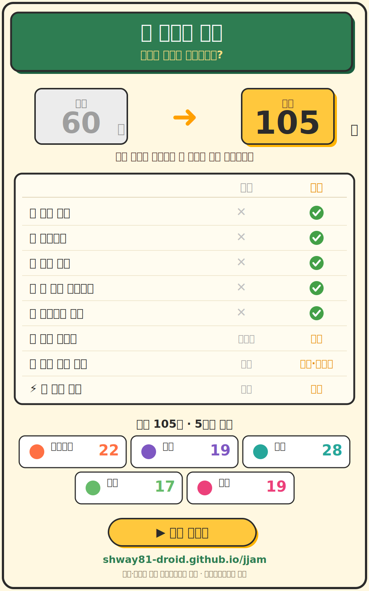

# 🎮 짬짬이 교실

**전자칠판으로 즐기는 자투리 시간 초등 미니게임 149종.**
설치도 로그인도 없이 브라우저에서 바로 시작하고, 인터넷이 끊겨도 동작합니다.

▶️ **바로 하기 → https://shway81-droid.github.io/jjam/**

원작 [짬짬이 교실](https://shway81-droid.github.io/jjamjjami-gyosil/)(게임 60종)을 기반으로,
**게임을 149종으로 늘리고 교실에서 바로 쓰는 운영 도구를 더한** 후속 버전입니다.

## ✨ 주요 기능

- **🎲 게임 고르기, 쉽고 빠르게** — 큼직한 게임 카드 그리드 + "룰렛으로 골라줘" 버튼 + 카테고리 필터 + ⭐ 즐겨찾기(자주 쓰는 게임을 맨 위에 고정). 룰렛은 카테고리 필터를 켜 둔 상태면 그 안에서만 뽑습니다.
- **🙋 학생 뽑기** — 번호만 입력해 발표·순서를 정하는 추첨기. 한 번 뽑힌 번호는 다시 안 나오고(비복원), 전원이 다 뽑히면 자동으로 리셋됩니다. *이름 없이 번호만 쓰므로 개인정보 걱정이 없습니다.*
- **🔊 교실 환경 최적화** — 1280·1920px 대화면에서 글씨·버튼이 자동으로 커지고, 조작 요소는 학생 손이 닿는 화면 아래쪽에 배치됩니다. 교실 스피커를 전제로 **소리 기본 ON**.
- **🎵 첫인상까지** — 첫 화면에 흐르는 배경음악, 전자칠판에 맞춘 보드게임풍 디자인(펠트 그린·우드 프레임·골드 버튼), 우상단 **전체화면** 버튼.
- **📴 오프라인 동작** — PWA + 서비스 워커로 한 번 열어 두면 인터넷 없이도 플레이됩니다(학교 크롬북·태블릿).

## 원작과 달라진 점



| 항목 | 원작 (jjamjjami-gyosil) | 이 버전 (jjam) |
|---|---|---|
| 게임 수 | 60종 | **149종** (중복 메커니즘 정리 + 신규 대거 추가) |
| 학생 뽑기 | ✗ | ✅ 번호 비복원 추첨 (개인정보 없음) |
| 즐겨찾기 | ✗ | ✅ ⭐ 상단 고정 |
| 게임 룰렛 | ✗ | ✅ 카테고리 필터 연동 |
| 첫 화면 배경음악 | ✗ | ✅ |
| 전체화면 버튼 | ✗ | ✅ |
| 소리 기본값 | 음소거 | **켜짐** |
| 학년 구분 표시 | 있음 | 없앰 (화면 단순화) |
| 첫 로딩 | 게임마다 개별 요청 | 통합본 1요청으로 단축 |

## 게임 149종 (카테고리 분포)

⚡반응속도 23 · 🧠두뇌 24 · 📐수학 31 · 📚지식 28 · 🤝협력 21 · 🧩퍼즐 22

게임 선별·삭제 기준은 [docs/SELECTION.md](docs/SELECTION.md)에, 새 게임을 추가할 때 피하는
안티패턴은 [docs/GAME_ANTIPATTERNS.md](docs/GAME_ANTIPATTERNS.md)에 정리되어 있습니다.

## 구조 (개발자용)

```
index.html          # 런처 (룰렛·학생 뽑기·즐겨찾기·게임 그리드)
shared/style.css    # 공통 스타일 + 보드게임 테마 레이어
shared/engine.js    # 타이머·점수판·Web Audio 효과음/배경음악·onTap
games/<폴더>/        # 게임별 game.json + index.html + style.css + game.js
games/registry.json # 게임 목록
games/meta.json     # 전 게임 메타 통합본 (런처가 1요청으로 받음, gen-metadata 생성)
sw.js               # 오프라인 서비스 워커
scripts/verify-game.js  # 게임 1개 정적 검증 21항목 (node scripts/verify-game.js <폴더>)
scripts/verify-all.js   # 전 게임 일괄 검증 + registry 정합성 (npm test)
scripts/gen-metadata.js # game.json → 파생 메타 생성 (npm run gen)
```

### 메타데이터 단일 소스

게임의 `category`(필터·BGM 분류)와 `players`(인원 배지)는 **`game.json`에만** 둔다.
런처의 `FALLBACK_GAMES`·`engine.js`의 `_GAME_CATEGORY_MAP`·`games/meta.json`(런처가 런타임에
1요청으로 받는 전 게임 메타 통합본)은 `game.json`에서 `scripts/gen-metadata.js`가 자동 생성한다.
게임을 추가·수정하면:

```
npm run gen   # 파생 메타 재생성 (engine.js / index.html / games/meta.json)
npm test      # 동기화 확인(gen --check) + 전 게임 정적 검증 (CI와 동일)
```

CI(`.github/workflows/ci.yml`)가 PR마다 `npm test`로 동기화·검증을 강제한다.

## 로컬 실행

```
python -m http.server 8000
# http://localhost:8000
```
